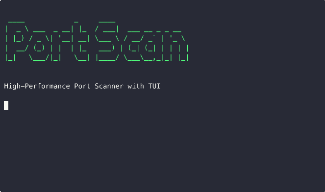

# 🚀 Go TUI Port Scanner

<div align="center">

**High-performance terminal-based port scanner with real-time TUI visualization**

[](https://golang.org/)
[](LICENSE)
[](https://github.com/lucchesi-sec/portscan/releases)
[](https://github.com/lucchesi-sec/portscan/actions)



</div>

## ✨ Features

- **🔥 Blazing Fast** – Scan 7,500+ ports/second with intelligent rate limiting
- **🎨 Beautiful TUI** – Real-time progress bars, sortable tables, and live metrics
- **🌐 Multi-Target Aware** – Pass multiple hosts, CIDRs, or stdin lists in one scan
- **🔍 Service Detection** – Banner grabbing helps identify running services
- **🌊 UDP Support** – Comprehensive UDP scanning with service-specific probes
- **📊 Streaming Exports** – NDJSON, JSON array/object, and CSV without buffering
- **⚡ Resource Efficient** – <50 MB memory usage for /24 network scans
- **🛡️ Sensible Defaults** – Built-in rate limiting and safe retry/backoff behaviour
- **📦 Cross-Platform** – Linux, macOS, Windows binaries available

## 🎯 Quick Start

### Installation

#### Via Go Install
```bash
go install github.com/lucchesi-sec/portscan/cmd@latest
```

#### Download Binary
```bash
# Linux/macOS
curl -sSL https://github.com/lucchesi-sec/portscan/releases/latest/download/portscan-linux-amd64.tar.gz | tar xz

# Windows
curl -sSL https://github.com/lucchesi-sec/portscan/releases/latest/download/portscan-windows-amd64.zip -o portscan.zip
```


### Basic Usage

```bash
# Scan common ports on localhost
portscan scan localhost

# Scan multiple targets at once
portscan scan api.internal db.internal 192.168.1.10 --ports 80,443,5432

# Read targets from stdin (whitespace or newline separated)
cat targets.txt | portscan scan --stdin --profile quick

# Scan port range with banner grabbing
portscan scan 10.0.0.0/24 --ports 1-1024 --banners

# High-speed scan with custom rate
portscan scan target.com --ports 1-65535 --rate 10000

# UDP scanning
portscan scan 192.168.1.1 --protocol udp --profile udp-common

# Scan both TCP and UDP
portscan scan 192.168.1.1 --protocol both --profile gateway
```

## 🖥️ Terminal Interface

The TUI provides real-time visualization of scan progress:

```
┌─ Port Scanner ───────────────────────────────────────────────────────────-──┐
│ Targets: 192.168.1.0/24 (1024 ports)       Rate: 7500 pps                  │
├─────────────────────────────────────────────────────────────────────────────┤
│ Progress: ████████████████████░░░░  82% (840/1024)   ETA: 00:23             │
├─────────────────────────────────────────────────────────────────────────────┤
│ Host           Port  State  Service    Banner                               │
├─────────────────────────────────────────────────────────────────────────────┤
│ 192.168.1.1    22    open   ssh        SSH-2.0-OpenSSH_8.9p1                │
│ 192.168.1.1    80    open   http       Apache/2.4.41 (Ubuntu)               │
│ 192.168.1.1    443   open   https      nginx/1.18.0                         │
│ 192.168.1.5    3306  open   mysql      5.7.34-0ubuntu0.18.04.1              │
│ 192.168.1.10   5432  open   postgres   PostgreSQL 13.3                      │
├─────────────────────────────────────────────────────────────────────────────┤
│ Stats: 5 open, 835 closed, 184 filtered  •  Memory: 12MB  •  Goroutines: 100│
└─────────────────────────────────────────────────────────────────────────────┘
```

**Navigation:**
- `↑/↓` or `j/k` - Navigate results
- `g/G` - Jump to top/bottom
- `/` - Search results
- `q` - Quit application

## 📋 Command Line Options

```bash
Usage:
  portscan scan [targets...] [flags]

Flags:
  -p, --ports string      Ports to scan (default "1-1024")
                         Examples: "80,443,8080" or "1-1024" or "1-1000,8000-9000"
  -P, --profile string   Scan profile: quick, web, database, gateway, udp-common, full
  -u, --protocol string  Protocol to scan: tcp (default), udp, or both
  -r, --rate int         Packets per second rate limit (default 7500)
  -t, --timeout int      Connection timeout in milliseconds (default 200)
  -w, --workers int      Number of concurrent workers (default 100)
  -b, --banners          Grab service banners
  -o, --output string    Output format: json, csv
      --json             Output results as JSON to stdout
  -s, --stdin            Read whitespace/newline separated targets from stdin
      --ui.theme string  UI theme: default, dracula, monokai (default "default")
      --config string    Config file path (default "~/.portscan.yaml")
## 🔧 Configuration

Create `~/.portscan.yaml` for persistent settings:

```yaml
# Performance settings
rate: 7500              # packets per second
workers: 100             # concurrent workers
timeout_ms: 200          # connection timeout

# Default scan settings
ports: "1-1024,3306,5432,6379,8080,8443"
banners: true

# Output preferences
output: ""               # default to TUI
ui:
  theme: dracula

```

### Target Input

- **Positional arguments** – `portscan scan host1 host2 192.168.1.10`
- **CIDR notation** – automatically expands (defaults to max 65,536 hosts per CIDR)
- **Standard input** – `cat targets.txt | portscan scan --stdin`
  - Input is tokenised on whitespace, so files can be space or newline separated.

Duplicate hosts are removed automatically before scanning.

## 📤 Export Formats

### JSON Output
```bash
portscan scan 192.168.1.1 --json
```
By default, JSON is streamed as NDJSON (one JSON object per line), ideal for large scans:
```text
{"host":"192.168.1.1","port":22,"state":"open","service":"ssh","banner":"SSH-2.0-OpenSSH_8.9p1","response_time_ms":5.2}
{"host":"192.168.1.1","port":80,"state":"closed","service":"http","banner":"","response_time_ms":1}
```

To emit a single JSON array (still streamed, no buffering):
```bash
portscan scan 192.168.1.1 --json --json-array > results.json
```

To emit a single JSON object with scan_info and results[]:
```bash
portscan scan 192.168.1.1 --json --json-object > results.json
```
Example output shape:
```json
{
  "results": [
    {
      "host": "192.168.1.1",
      "port": 22,
      "state": "open",
      "service": "ssh",
      "banner": "SSH-2.0-OpenSSH_8.9p1",
      "response_time_ms": 5.2
    }
  ],
  "scan_info": {
    "targets": ["192.168.1.1"],
    "start_time": "2025-01-15T10:30:00Z",
    "end_time": "2025-01-15T10:30:45Z",
    "total_ports": 1024,
    "scan_rate": 7500
  }
}
```

### CSV Output
```bash
portscan scan 192.168.1.1 --output csv > results.csv
```

## 🌐 UDP Scanning

PortScan supports comprehensive UDP scanning alongside traditional TCP scanning. UDP scanning is essential for discovering services like DNS, DHCP, VPN protocols, and VoIP.

### UDP Protocol Features

- **Service-Specific Probes**: Optimized probes for common UDP services
- **Smart Detection**: Identifies services based on response patterns
- **Rate Limiting**: Conservative rate limiting to avoid ICMP rate limits
- **Multi-Protocol**: Scan TCP and UDP simultaneously

### UDP Usage Examples

```bash
# Scan common UDP services
portscan scan 192.168.1.1 --protocol udp --profile udp-common

# Scan gateway with both protocols
portscan scan 192.168.1.1 --protocol both --profile gateway

# Scan specific UDP ports
portscan scan router.local --protocol udp --ports 53,67,68,123,161,1194

# Gateway service discovery
portscan scan pbx.company.com --protocol udp --profile gateway
```

### Available UDP Profiles

- **udp-common**: DNS, DHCP, NTP, SNMP, OpenVPN, WireGuard
- **gateway**: Router/gateway services (TCP & UDP)

### UDP Service Detection

PortScan automatically detects and identifies common UDP services:

| Port | Service | Detection Method |
|------|---------|-----------------|
| 53 | DNS | DNS query response |
| 67/68 | DHCP | DHCP packet format |
| 123 | NTP | NTP version response |
| 161 | SNMP | SNMP packet structure |
| 500/4500 | IPSec | IKE handshake |
| 1194 | OpenVPN | OpenVPN response |
| 51820 | WireGuard | WireGuard handshake |

### UDP Scanning Considerations

- **Slower than TCP**: UDP scanning relies on timeouts and ICMP responses
- **Less Reliable**: Many services don't respond to empty UDP packets
- **Rate Limited**: OS-level ICMP rate limiting affects scan speed
- **No Privileges Required**: Uses standard UDP sockets, no raw socket access needed

## 🏗️ Architecture

```
┌─────────────────┐    ┌─────────────────┐    ┌─────────────────┐
│   CLI Parser    │───▶│  Core Scanner   │───▶│   TUI Display   │
│  (Cobra/Viper)  │    │ (Worker Pool)   │    │ (Bubble Tea)    │
└─────────────────┘    └─────────────────┘    └─────────────────┘
                              │
                              ▼
                       ┌─────────────────┐
                       │    Exporters    │
                       │  (JSON/CSV)     │
                       └─────────────────┘
```

**Core Components:**
- **Scanner Engine**: High-performance worker pool with rate limiting
- **TUI Framework**: Built with Charm's Bubble Tea ecosystem
- **Export System**: JSON and CSV output formats
- **Configuration**: Hierarchical config management

## 🚄 Performance

| Metric | Value |
|--------|-------|
| **Scan Rate** | 7,500+ packets/second |
| **Memory Usage** | <50MB for /24 networks |
| **UI Framerate** | 30 FPS real-time updates |
| **Concurrency** | 100+ concurrent workers |
| **Platforms** | Linux, macOS, Windows |

### Benchmarks

```bash
# Benchmark different scenarios
go test -bench=. ./internal/core

BenchmarkTCPScan/1000_ports-8         	     100	  10234567 ns/op
BenchmarkTCPScan/10000_ports-8        	      10	 102345678 ns/op
BenchmarkWorkerPool/100_workers-8     	     500	   2034567 ns/op
BenchmarkRateLimiter/7500_pps-8       	    1000	   1234567 ns/op
```

## 🛠️ Development

### Building from Source

```bash
# Clone repository
git clone https://github.com/lucchesi-sec/portscan.git
cd portscan

# Install dependencies
go mod download

# Build binary
make build

# Run tests
make test

# Run linting
make lint
```

### Project Structure

```
portscan/
├── cmd/                 # CLI commands and entry point
├── internal/
│   ├── core/           # Scanner engine and worker pool
│   └── ui/             # Bubble Tea TUI components
├── pkg/
│   ├── config/         # Configuration management
│   ├── exporter/       # Output format exporters (JSON/CSV)
│   ├── parser/         # Input parsing utilities
│   └── theme/          # UI themes and styling
├── scripts/            # Development and build scripts
└── .github/workflows/  # CI/CD pipelines
```

### Testing

```bash
# Run all tests
make test

# Run with coverage
make test-coverage

# Run benchmarks
make benchmark

# Fuzz testing
go test -fuzz=FuzzPortParser ./pkg/parser
```

## 🔒 Security Considerations

- **Rate Limiting**: Prevents network congestion and IDS detection
- **Privilege Management**: Drops root privileges after initialization
- **Input Validation**: Strict validation of all user inputs
- **Dependency Scanning**: Regular vulnerability scans with `govulncheck`
- **Audit Logging**: Optional logging of all scan activities

## 📝 Use Cases

### Security Assessment
```bash
# Quick security scan of DMZ
portscan scan 10.0.1.0/24 --ports 21,22,23,25,53,80,110,443,993,995 --banners

# Comprehensive internal network audit
portscan scan 192.168.0.0/16 --ports 1-65535 --rate 5000 --output json > audit.json
```

### DevOps Validation
```bash
# Pre-deployment service check
echo "api.example.com\ndb.example.com" | portscan scan --stdin --ports 80,443,3306,5432

# Container network validation
portscan scan 172.17.0.0/16 --ports 8080,9090 --timeout 100
```

### Network Discovery
```bash
# Find active hosts and services
portscan scan 192.168.1.0/24 --ports 22,80,135,139,443,445 --banners
```

## 🤝 Contributing

We welcome contributions! Please see our [Contributing Guide](CONTRIBUTING.md) for details.

### Quick Contribution Steps

1. **Fork** the repository
2. **Create** a feature branch (`git checkout -b feature/amazing-feature`)
3. **Commit** your changes (`git commit -m 'feat: add amazing feature'`)
4. **Push** to the branch (`git push origin feature/amazing-feature`)
5. **Open** a Pull Request

### Development Environment

```bash
# Install development tools
make dev-setup

# Run in development mode
make dev

# Debug with verbose logging
PORTSCAN_DEBUG=1 go run cmd/main.go scan localhost

# Run lint suite
make lint
```

`make dev-setup` installs `golangci-lint` (running Staticcheck, gofumpt, revive, etc.), the Go language server `gopls`, and other helpers so editors and CI share the same tooling.

## 📊 Roadmap

- [ ] **v0.3.0**: SQLite export, Web UI, SSH TUI serving
- [ ] **v0.4.0**: IPv6 support
- [ ] **v1.0.0**: SYN scanning, plugin architecture, vulnerability detection

## 📜 License

This project is licensed under the MIT License - see the [LICENSE](LICENSE) file for details.

## 🙏 Acknowledgments

- [Charm](https://charm.sh/) - For the amazing TUI framework ecosystem
- [Cobra](https://cobra.dev/) - For the CLI framework
- [Viper](https://github.com/spf13/viper) - For configuration management

## 📬 Support

- **Issues**: [GitHub Issues](https://github.com/lucchesi-sec/portscan/issues)
- **Discussions**: [GitHub Discussions](https://github.com/lucchesi-sec/portscan/discussions)
- **Security**: [security@lucchesi-sec.com](mailto:security@lucchesi-sec.com)

---

<div align="center">
<strong>⭐ If you find this project useful, please consider giving it a star ⭐</strong>
</div>
